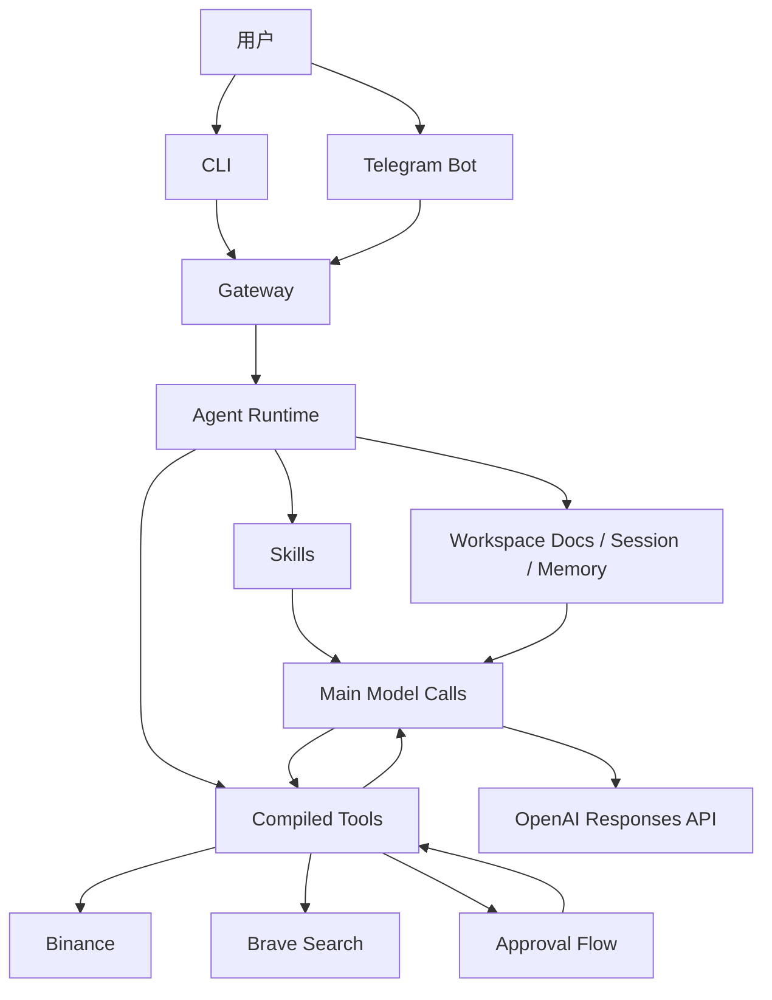

# BinaClaw：一个面向 Binance 的 AI Agent

> 项目地址：[Donald-Ada/BinaClaw](https://github.com/Donald-Ada/BinaClaw)

## 为什么做 BinaClaw

我做 BinaClaw 的初衷，并不是再做一个“能聊天的通用 AI”，而是想做一个真正贴近交易场景的、能够围绕 Binance 生态工作的 AI Agent。

在实际使用里，通用聊天模型经常会遇到几个问题：

- 它知道很多概念，但不知道 Binance 官方接口、交易规则和参数边界
- 它能给建议，但很难形成一条可以真正执行的工作流
- 它可以“看起来像懂交易”，但在高风险动作上往往缺少本地控制和审批机制
- 它对长期上下文、技能加载、工具调用和会话状态的组织往往不够稳定

所以我想做一个更聚焦的产品：它不是泛用型助手，而是一个 Binance 专属 AI Agent。  
它需要同时满足这些要求：

- 对交易、账户、行情、热点信息有明确的能力边界
- 能理解官方 Binance Skills，而不是只靠硬编码 prompt
- 能同时工作在本地终端和 Telegram 中
- 能把危险动作从“聊天建议”升级成“审批后执行”
- 能把用户配置、密钥、本地记忆、会话状态拆开管理

这就是 BinaClaw 的出发点。

## 为什么参考 OpenClaw

BinaClaw 的底层设计概念来自 OpenClaw，但它并不是 OpenClaw 的简单复制品。

我借鉴 OpenClaw 的核心点主要有三类：

1. `skill-first runtime`
   先让模型理解有哪些技能，再基于技能决定当前回合应该使用哪些能力。

2. `workspace as source of truth`
   把长期上下文放在本地工作区里，而不是把所有状态都塞进一段 prompt 中。

3. `agent runtime + tool execution` 分层
   模型负责判断和决策，runtime 负责执行、校验、审批和落盘。

但 BinaClaw 并没有照搬 OpenClaw 的整套平台化设计。  
我做了明显的 Binance 专属化收敛：

- 以 Binance 官方风格 `SKILL.md` 为主输入
- 围绕行情、账户、资产、交易、热点信息这些高频场景做能力封装
- 加入交易确认流，避免模型“口头下单”
- 将 Binance 密钥单独处理，避免混进普通配置文件
- 让 CLI、Gateway、Telegram 都围绕同一套 agent runtime 工作

所以更准确的说法是：

**BinaClaw 借鉴了 OpenClaw 的分层思想，但它是一个针对 Binance 交易场景专门设计的 AI Agent。**

## BinaClaw 的核心设计

BinaClaw 当前可以理解成四层：

1. `Workspace docs`
2. `Skills`
3. `Tools`
4. `Main model calls`

它们各自负责不同的事情。

### 1. Workspace docs

工作区保存在本地 `~/.binaclaw/workspace` 下，用来放长期上下文，而不是临时聊天内容。

典型文件包括：

- `AGENTS.md`
- `SOUL.md`
- `USER.md`
- `IDENTITY.md`
- `TOOLS.md`
- `MEMORY.md`
- `memory/YYYY-MM-DD.md`
- `sessions/sessions.json`
- `sessions/<session-id>.jsonl`

这些文件让 BinaClaw 具备“持续工作”的能力，而不是每轮都像第一次聊天。

### 2. Skills

BinaClaw 的技能体系以官方 Binance 风格 `SKILL.md` 为核心。

模型不会直接从“所有工具定义”里盲选，而是：

- 先看当前可用的 skills
- 判断这轮应该用哪个或哪些 skill
- 再读取选中的 `SKILL.md`
- 必要时再读取对应的 `references/*`
- 最后决定要调用哪个能力

这种设计让模型不是“背规则”，而是在运行时“读规则”。

### 3. Tools

真正执行动作的是 runtime tools，而不是模型自己裸拼 HTTP 请求。

这层负责：

- 调 Binance 公共接口
- 调 Binance 私有签名接口
- 调 Brave Search
- 读取本地 memory / workspace
- 执行审批后的危险动作

这样做的关键好处是：

- 模型可以决定“应该做什么”
- runtime 决定“怎么安全地做”

### 4. Main model calls

BinaClaw 不是把每一步都拆成很多次模型调用，而是尽量让主模型调用承担关键决策：

- 选 skill
- 读 skill
- 决定该走哪个 endpoint / tool
- 没有工具时直接回复
- 有工具结果时做总结分析

这样既保留了 Agent 的智能性，也避免把调用链拉得太长。

## 架构图

下面这张图是 BinaClaw 当前最核心的运行链路：



这条链路里最重要的几个点是：

- `skill-first runtime`：模型先围绕 skill 决策，不是直接从一堆底层接口里乱选
- `workspace` 是长期上下文来源，而不是纯 prompt 拼接
- `tool execution` 和 `approval flow` 由 runtime 控制，不是模型裸发请求

## 安装与配置

### 运行环境

- Node.js `>=22`
- npm

### 安装

```bash
npm install -g binaclaw
```

### 首次配置

```bash
binaclaw onboard
```

当前 `onboard` 会引导你配置这些字段：

- `BINACLAW_GATEWAY_PORT`
- `OPENAI_API_KEY`
- `OPENAI_MODEL`
- `TELEGRAM_BOT_TOKEN`
- `TELEGRAM_ALLOWED_USER_IDS`
- `BRAVE_SEARCH_API_KEY`
- `BINANCE_API_KEY`
- `BINANCE_API_SECRET`

完成后会自动：

- 保存本地配置
- 后台启动 `gateway`
- 后台启动 `telegram provider`

### 本地数据与安全

有两类数据需要分开看：

#### 1. 普通配置

默认写入：

```text
~/.binaclaw/config.json
```

这类通常包括：

- OpenAI Key / Model
- Telegram Bot Token
- Telegram allowlist
- Brave Search API Key
- Gateway 端口

#### 2. Binance 金融密钥

默认写入：

```text
~/.binaclaw/env.local
```

也就是：

- `BINANCE_API_KEY`
- `BINANCE_API_SECRET`

它们**不会进入 `config.json`**。  
这样做的原因很简单：Binance 是金融场景，密钥应该和普通配置分离。

## 如何使用

### 1. 本地终端

```bash
binaclaw chat
```

你可以直接问：

```text
今天 BNB 能买吗
分析一下 BTC 和 ETH 今天怎么样
帮我查下我的资产
BTCUSDT 现货，市价买入 20 USDT
卖出全部 BTC 为 USDT，按市价
```

### 2. Telegram

完成一次 `binaclaw onboard` 后，用户通常就可以直接在 Telegram 中和 AI Agent 对话。

这是 BinaClaw 我很看重的一点：  
用户不一定非要守着终端，也可以在 Telegram 里直接完成分析、查询和确认交易动作。

### 3. 后台服务

常用命令：

```bash
binaclaw gateway
binaclaw gateway stop
binaclaw telegram
binaclaw telegram stop
```

### 4. 调试与可观测性

BinaClaw 还提供了比较清晰的自查能力：

- `/trace`
- `/session`
- `binaclaw auth status`
- `binaclaw doctor`

这让它不只是“能用”，也能“看清它在怎么工作”。

## 安全与边界

BinaClaw 不是一个“会说自己已经下单成功”的演示机器人。  
我对它的安全边界做了比较明确的约束：

- 行情数据按实时数据处理，不依赖长期缓存做交易决定
- 公共只读请求可直接执行
- 私有 Binance 请求必须具备有效凭证
- 危险动作必须经过确认流
- 在拿到真实交易所回执前，不会伪造成交结果

这点对交易类 AI Agent 很重要。  
如果没有这层边界，模型很容易从“建议你下单”滑向“假装已经帮你下单”。

## 开源与协作

项目源码已经开源：

- [https://github.com/Donald-Ada/BinaClaw](https://github.com/Donald-Ada/BinaClaw)

我非常欢迎大家来一起优化它，包括但不限于：

- 技能体系设计
- Runtime 架构
- CLI / Telegram 交互体验
- Binance 场景覆盖
- 安全策略
- 文档与测试

如果你对 OpenClaw、技能系统、Agent Runtime、交易安全、终端产品体验有经验，我会非常欢迎你来提 issue、PR 或架构建议。

## 结语

BinaClaw 目前还是初版，但它已经具备一条完整且可用的链路：

- 可以安装
- 可以配置
- 可以本地终端使用
- 可以接入 Telegram
- 可以基于官方 Binance Skills 工作
- 可以查询、分析、准备交易，并在确认后执行

对我来说，这不是一个“会聊天的脚本”，而是一个真正开始具备产品形态的 Binance 专属 AI Agent。

后面它当然还有很多可以继续打磨的地方，但初版最重要的目标已经达成：

**把 OpenClaw 风格的 agent 设计理念，真正落到一个 Binance 专属、可安装、可使用、可开源协作的产品上。**
